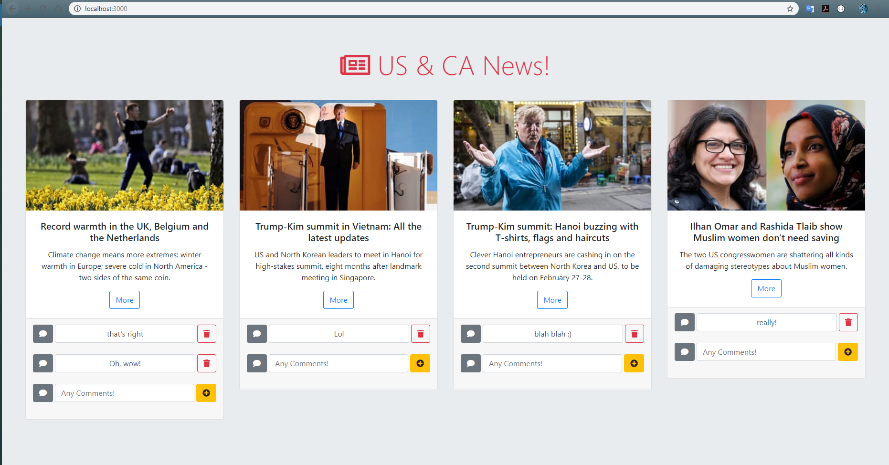

# News Scraper Using NodeJS

## Overview
In this application, the user will have ability to view the last four breaking news in Canada & US that presented in [`ALJazeera News Website`](https://www.aljazeera.com/topics/regions/us-canada.html), the app also saves the news in database and provide to user to add and remove comments on every news.

## Project Dependencies:
This app requires all these node packages: `Cheerio`, `express`, `express-handlebars`, `MongoDB`, `Mongoose`.

## Basic Usage:
The app runs by navigating into the directory of the app folder, and then type the command  `node server.js` in the command line terminal

* To access the app, open the web-browser and navigate to: "localhost:3000", then the following parts will be seen in the page:

* The main page of the app is presenting all news that had been saved into the database, and giving the ability to user to add or remove comments on each news.

Here's an example for the application in the figures below: 

## Try it on HEROKU:
This link will jump you to test the application, have fun!
 
  * ["Try it"](https://powerful-wave-44007.herokuapp.com/)

